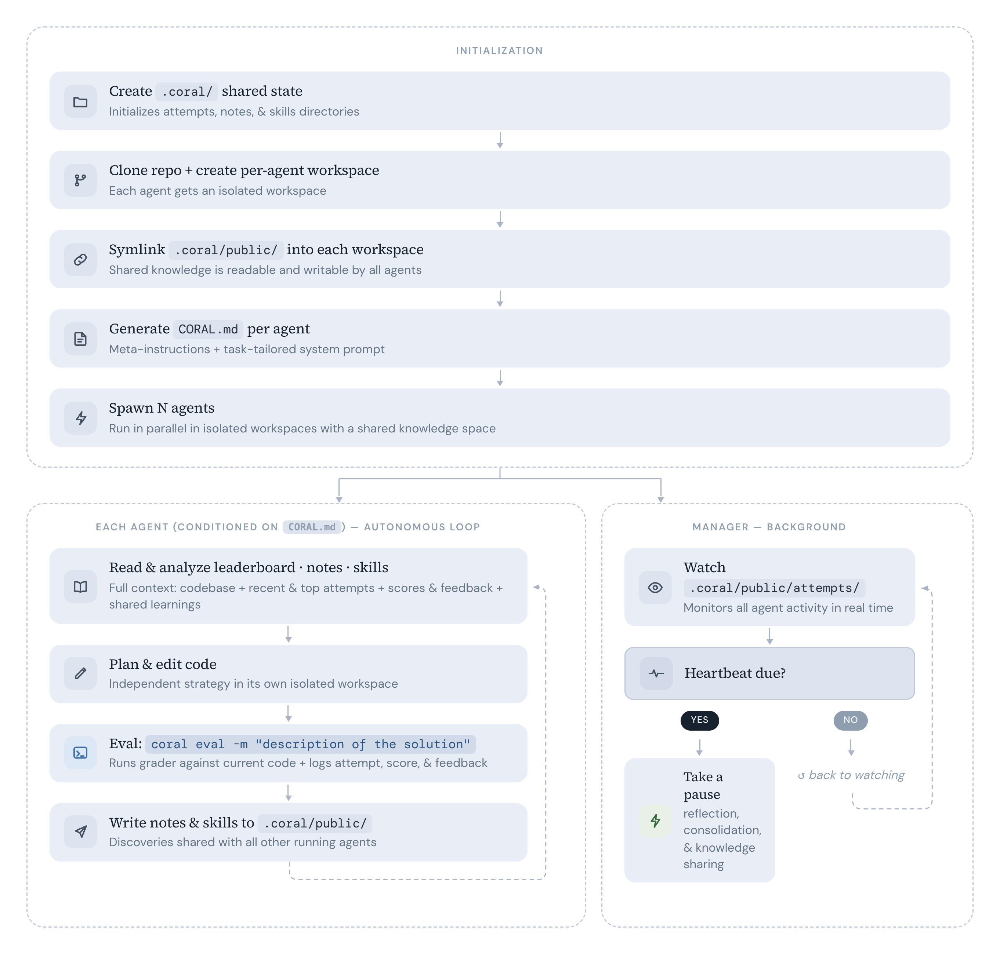

<div align="center">


### **一键启动智能体群组，共享知识，无限进化**

<p>
  
  &nbsp;&nbsp;&nbsp;&nbsp;&nbsp;&nbsp;
  
  &nbsp;&nbsp;&nbsp;&nbsp;&nbsp;&nbsp;
  
</p>

[](https://human-agent-society.github.io/CORAL/)
[](LICENSE)
[](https://python.org)
[](https://docs.astral.sh/uv/)

[English](README.md) | **中文**

</div>


<p align="center">
<a href="#安装">安装</a> · <a href="#支持的-agent">支持的 Agent</a> · <a href="#使用">使用</a> · <a href="#工作原理">工作原理</a> · <a href="#快速上手">快速上手</a> · <a href="#cli-命令">CLI 命令</a> · <a href="#示例">示例</a> · <a href="#许可证">许可证</a>
</p>

**CORAL** 是一套用于构建**自主 AI Agent 组织**的基础设施，Agent 们持续运行实验、共享知识、不断进化出更优方案。只需提供代码库和评分脚本，Coral 即可完成剩余工作：隔离工作空间、安全评估、持久化共享知识，以及多 Agent 协作驱动持续进化。原生集成 Claude Code、OpenCode、Codex 等主流编程 Agent。

想要自我进化的 AI，又不想折腾配置？试试 Coral。


### 🔥 News!

- **[2026-03-18]** CORAL 正式发布！点击查看[Blog](https://human-agent-society.github.io/CORAL/)。


### 安装

```bash
git clone https://github.com/Human-Agent-Society/CORAL.git
cd CORAL
# 从 https://github.com/astral-sh/uv 安装 uv
uv sync                   # （可选：添加 --extra ui 以包含看板依赖）
```

### 支持的 Agent

CORAL 支持任何可以作为子进程运行并通过终端交互的编程 Agent。目前支持：

| Agent | 说明 |
|-------|------|
| [**Claude Code**](https://github.com/anthropics/claude-code) | Anthropic 的 Agentic 编程工具——默认且测试最充分的运行时 |
| [**Codex**](https://github.com/openai/codex) | OpenAI 的开源编程 Agent |
| [**OpenCode**](https://github.com/opencode-ai/opencode) | 开源终端 AI 编程 Agent |

> [!TIP]
> 在使用 CORAL 之前，请确保已完整配置好你计划使用的 Agent：
>
> - **安装 Agent：** 按照对应 Agent 的官方安装说明进行安装（如 Claude Code、Codex、OpenCode），可能涉及安装包、配置可执行文件或脚本。
> - **身份验证：** 提前登录并完成 Agent 的身份验证，确保其在 CLI 模式下不会弹出凭据请求。按照 Agent 文档配置所需的环境变量、配置文件或认证密钥。
> - **权限设置：** 通过 Agent 的配置文件（如 Claude Code 的 `~/.claude/settings.json`）配置权限，控制 Agent 可以使用的工具、访问的路径或执行的操作。
>
> *CORAL 不负责 Agent 的安装或身份验证。如果底层 Agent 无法启动或未正确完成认证，基础设施将无法正常运行。*

在任务配置中指定 Agent（参见 <a href="#3-配置任务">配置任务</a>）：

```yaml
agents:
  runtime: claude_code   # 或 "codex" 或 "opencode"
  count: 3
  model: opus  

```

### 使用

```bash
# 启动
uv run coral start --config examples/kernel_builder/task.yaml

# 停止和恢复
uv run coral stop                                      # 暂停
uv run coral resume                                    # 继续

# 监控进度
uv run coral ui                                        # 打开 Web 看板
```

### 工作原理

<p align="center">
  
</p>

每个 Agent 跑在自己的 git worktree 分支里。共享状态（历史记录、笔记、技能）放在 `.coral/public/`，软链到所有 worktree —— 零开销，实时互通。后台管理器盯着新提交，可以通过心跳机制打断 Agent 并注入指令（比如"回顾一下"、"整理技能"）。

| 概念 | 说明 |
|------|------|
| **Agent = 优化器** | Claude Code / Codex / OpenCode 子进程，各占一个 git worktree |
| **共享状态** | `.coral/` 存放历史记录、笔记和技能，软链到每个 worktree |
| **Eval 循环** | Agent 调 `uv run coral eval -m "..."` 一步完成暂存 + 提交 + 打分 |
| **CLI 调度** | 17+ 条命令：`start`、`stop`、`status`、`eval`、`log`、`ui` 等 |
| **Web 看板** | `uv run coral ui` —— 实时排行榜、diff 对比、Agent 监控 |

### 快速上手

以一个完整的例子来演示：多个 Agent 持续优化 **100 城市旅行商问题（TSP）**。

#### 1. 写初始代码

初始代码（seed）是 Agent 迭代优化的起点。创建工作目录：

```bash
mkdir -p examples/tsp/{seed,eval}
```

然后创建一个最简初始方案（你也可以选择从空开始，虽然这可能会让 Agent 的工作更具挑战性）：

```python
# examples/tsp/seed/solution.py
import random

# 在此重述问题，因为 Agent 无法读取 `grader.py` 的内容
random.seed(42)
CITIES = [(random.random(), random.random()) for _ in range(100)]

# 最简方案：按编号顺序访问 (0, 1, 2, ..., 99)
for i in range(len(CITIES)):
    print(i)
```

#### 2. 写评分器

继承 `TaskGrader`，实现 `evaluate()` 方法。基类提供两个辅助方法：`self.run_program(filename)` 在子进程中运行 Agent 代码库里的文件，返回 `CompletedProcess`（含 `.stdout`、`.stderr`、`.returncode`）；`self.fail(reason)` 记录失败并返回 `-inf` 作为得分：

```python
# examples/tsp/eval/grader.py
import math
import random
from coral.grader import TaskGrader, ScoreBundle

# 保持与 `solution.py` 中的问题描述一致
random.seed(42)
CITIES = [(random.random(), random.random()) for _ in range(100)]

class Grader(TaskGrader):
    def evaluate(self) -> float | ScoreBundle:
        try:
            result = self.run_program("solution.py")  # 运行 solution.py，返回 CompletedProcess
            order = [int(x) for x in result.stdout.strip().split("\n")]
            assert sorted(order) == list(range(len(CITIES)))
            dist = sum(
                math.dist(CITIES[order[i]], CITIES[order[(i + 1) % len(order)]])
                for i in range(len(order))
            )
            return -dist  # 路线越短，得分越高
        except Exception as e:
            return self.fail(str(e))  # 记录失败并返回 -inf
```

初始方案按编号顺序访问，得分约 `-58.02`。Agent 会尝试最近邻、2-opt、模拟退火等策略寻找更短路线。100 个城市的穷举搜索完全不可行（99! 种排列），因此 Agent 必须发现并运用真正的优化启发式算法。

#### 3. 配置任务

把配置指向初始代码和评分器：

```yaml
# examples/tsp/task.yaml
task:
  name: tsp
  description: |
    求 100 个城市的最短往返路线。坐标由 `solution.py` 中固定种子随机生成，
    请勿修改种子或 CITIES 的生成方式！

    solution.py 向 stdout 输出 100 个整数（0–99），每行一个，
    表示访问顺序，每个城市恰好出现一次。
    评分器计算往返欧氏距离，返回 -distance 作为得分（越短越高）。

grader:
  type: function
  module: eval.grader

agents:
  count: 1
  runtime: claude_code  # 或 opencode、codex
  model: claude-sonnet-4-6
  max_turns: 200  # Agent 重启前的最大轮数，别担心 Coral 会一直运行直到你停止

workspace:
  results_dir: "./results"  # 相对于你的 $PWD
  repo_path: "./examples/tsp/seed"  # 相对于你的 $PWD
```

#### 4. 跑起来

```bash
uv run coral start --config examples/tsp/task.yaml  # 随后你会在 tmux 会话 `coral-tsp` 中看到 Coral
uv sync --extra ui && uv run coral ui          # 打开 Web 看板，默认运行在 8420 端口
uv run coral status      # 看排行榜
uv run coral log         # 翻记录
uv run coral stop        # 收工
```

### CLI 命令


| 命令 | 说明 |
|------|------|
| `uv run coral init <name>` | 新建任务脚手架 |
| `uv run coral validate <name>` | 测试评分器 |
| `uv run coral start -c task.yaml` | 启动 Agent |
| `uv run coral resume` | 恢复上次运行 |
| `uv run coral stop` | 停止全部 Agent |
| `uv run coral status` | Agent 状态 + 排行榜 |
| `uv run coral log` | 排行榜（前 20） |
| `uv run coral log -n 5 --recent` | 最近的记录 |
| `uv run coral log --search "关键词"` | 搜索记录 |
| `uv run coral show <hash>` | 记录详情 + diff |
| `uv run coral notes` | 浏览笔记 |
| `uv run coral skills` | 浏览技能 |
| `uv run coral runs` | 列出所有运行 |
| `uv run coral ui` | Web 看板 |
| `uv run coral eval -m "描述"` | 暂存 + 提交 + 评估（Agent 调用）|
| `uv run coral diff` | 看未提交的改动 |
| `uv run coral revert` | 撤销上次提交 |
| `uv run coral checkout <hash>` | 回退到指定记录 |
| `uv run coral heartbeat` | 查看/修改心跳动作 |


### 项目结构


```
coral/
├── types.py             # Task, Score, ScoreBundle, Attempt
├── config.py            # YAML 配置加载
├── agent/
│   ├── manager.py       # 多 Agent 生命周期
│   └── runtime.py       # Claude Code / Codex / OpenCode 子进程
├── workspace/
│   └── setup.py         # Worktree 创建、hook、软链
├── grader/
│   ├── protocol.py      # GraderInterface 协议
│   ├── base.py          # BaseGrader（_make_score, _make_bundle）
│   ├── task_grader.py   # TaskGrader 任务评分基类
│   ├── loader.py        # 评分器发现与加载
│   └── builtin/
│       └── function_grader.py
├── hub/
│   ├── attempts.py      # 记录增删改查 + 排行榜 + 搜索
│   ├── notes.py         # Markdown 笔记（YAML frontmatter）
│   └── skills.py        # 技能包（含 SKILL.md）
├── hooks/
│   └── post_commit.py   # 提交后自动评估
├── template/
│   └── coral_md.py      # CORAL.md 生成器
├── web/                 # Starlette + React 看板
└── cli/                 # 5 个模块，17 条命令
```


### 示例

`examples/` 下有开箱即用的任务配置：

| 任务 | 领域 | 说明 |
|------|------|------|
| **circle_packing** | 优化 | 把 26 个圆塞进单位正方形，最大化半径总和 |
| **erdos** | 数学 | 求解数学猜想 |
| **kernel_builder** | 系统 | VLIW SIMD kernel 优化 |
| **kernel_engineering** | 系统 | GPU kernel 优化 |
| **mnist** | 机器学习 | 手写数字识别 |
| **spaceship_titanic** | 机器学习 | Kaggle 竞赛 |
| **stanford_covid_vaccine** | 生物/ML | mRNA 降解预测 |


### 开发

```bash
# 装开发依赖
uv sync --extra dev

# 跑测试
uv run pytest tests/ -v

# lint + 格式化
uv run ruff check .
uv run ruff format .
```

本项目在MIT [LICENSE](LICENSE) 许可下开源。

### 引用

⭐ 如果觉得 CORAL 对有帮助的话，欢迎给我们的 GitHub Repo 点个 Star。也可以考虑引用我们：

```bibtex
@article{coral2026,
  title  = {CORAL: Towards Autonomous Multi-Agent Evolution for Open-Ended Discovery},
  author = {Qu, Ao and Zheng, Han and Zhou, Zijian and Yan, Yihao and Tang, Yihong and Ong, Shao Yong and Hong, Fenglu and Zhou, Kaichen and Jiang, Chonghe and Kong, Minwei and Zhu, Jiacheng and Jiang, Xuan and Li, Sirui and Wu, Cathy and Low, Bryan Kian Hsiang and Zhao, Jinhua and Liang, Paul Pu},
  journal = {arXiv preprint arXiv:2604.01658},
  year   = {2026},
  url    = {https://arxiv.org/pdf/2604.01658}
}
```

### 致谢

我们感谢 [TNT Accelerator](https://www.tnt.so/) 提供的慷慨支持，包括在开发过程中给予帮助的各种 API 积分。也要感谢许多如 [OpenEvolve](https://github.com/algorithmicsuperintelligence/openevolve)、[autoresearch](https://github.com/karpathy/autoresearch)、[TTT Discover](https://arxiv.org/abs/2601.16175) 等的十分有启发性的工作，这些工作为 Coral 的诞生奠定了基础。
